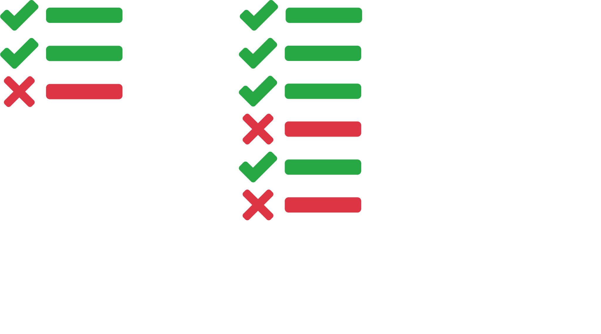

<!-- $theme: gaia -->

<link rel="stylesheet" href="../styles.css" />

<!-- *footer: Promotors: prof. Volckaert, prof. De Turck | Supervisors: Jasper Vaneessen, Dwight Kerkhove-->

<!-- Welkom enzo -->

# Optimizing ==CI== using
# ==Test Case Prioritization==

#### December 16, 2019

###### Pieter De Clercq

---

<!-- footer: Pieter De Clercq - December 16, 2019 -->
<!-- *template: invert -->

> Lost ==time== is never found again.
> 
> <small>-- *Benjamin Franklin*</small>

---

<!-- Dit zal ik vandaag bespreken -->

# Overview
1. What is ==C==ontinuous ==I==ntegration?

---

# Overview
1. What is ==C==ontinuous ==I==ntegration?
2. Problem

---

# Overview
1. What is ==C==ontinuous ==I==ntegration?
2. Problem
3. Existing solutions

---

# Overview
1. What is ==C==ontinuous ==I==ntegration?
2. Problem
3. Existing solutions
4. Velo==CI==ty

---

# Overview
1. What is ==C==ontinuous ==I==ntegration?
2. Problem
3. Existing solutions
4. Velo==CI==ty
5. Progress

---
<!-- *template: gaia -->

# What is CI?

---

## Agile Software Development

<!-- Veronderstel een bedrijf dat Android applicaties maakt -->

	

---

## Agile Software Development

<!-- Ontwikkelaars schrijven elk code -->

	

---

## Agile Software Development

<!-- Code wordt gepusht -->

	

---

## Agile Software Development

<!-- Tests worden uitgevoerd -->

	

---

## Agile Software Development

<!-- Tests worden uitgevoerd -->

	

---

## Agile Software Development

<!-- Tests worden uitgevoerd. Bestaande CI software: Jenkins, Travis, GitLab runners, GitHub Actions (nieuw) -->

	

---

## Agile Software Development

<!-- Publishen naar Play store -->

	

---

<!-- *template: gaia -->

<!-- Wat is nu precies het probleem? -->

# Problem

---

<!-- Tests zijn het probleem -->

# ==Tests!==

---

<!-- In het begin oké -->

# Tests

	

---

<!-- Naarmate project groeit -->

# Tests

	

---

<!-- Meer en meer tests die allemaal moeten uitvoeren: probleem. Veronderstel dat laatste test faalt, na 24 uur; dan 24u verspild.  -->

# Tests

	

---
<!-- *template: gaia -->

# Existing solutions

---

<!-- selecteer tests die proberen om alle bugs te vinden -->

# Existing solutions

- Test Case Selection

---

<!-- omgekeerd: begin van alle tests en gooi tests weg-->

# Existing solutions

- Test Case Selection
- Test Suite Minimization

---

<!-- voer alle tests uit in zo'n danige volgorde dat de meest falende tests eerst worden uitgevoerd -->

# Existing solutions

- Test Case Selection
- Test Suite Minimization
- :arrow_right: Test Case Prioritization

---

## Test Case Prioritization

- History based

---

## Test Case Prioritization

- History based
- Diversity (Coverage) based

---

## Test Case Prioritization

- History based
- Diversity (Coverage) based
  - Branch / Statement coverage
  - Distance metric

---

<!-- *template: gaia -->

# Velo==CI==ty

---

# Velo==CI==ty
- Compare ==TCP== algorithms

---

# Velo==CI==ty
- Compare ==TCP== algorithms
- Metapredictor

---

# Velo==CI==ty
- Compare ==TCP== algorithms
- Metapredictor
- Plugin for Jenkins CI

---

<!-- *template: gaia -->

# Progress

---

# Progress
- Data scraping

---

# Progress
- Data scraping
- Literature study

---

<!-- *template: gaia -->

# Questions?

---

## References
- Slides created using [Marp](https://marpit.marp.app/).
- Icons are property of [FontAwesome](https://fontawesome.com/).