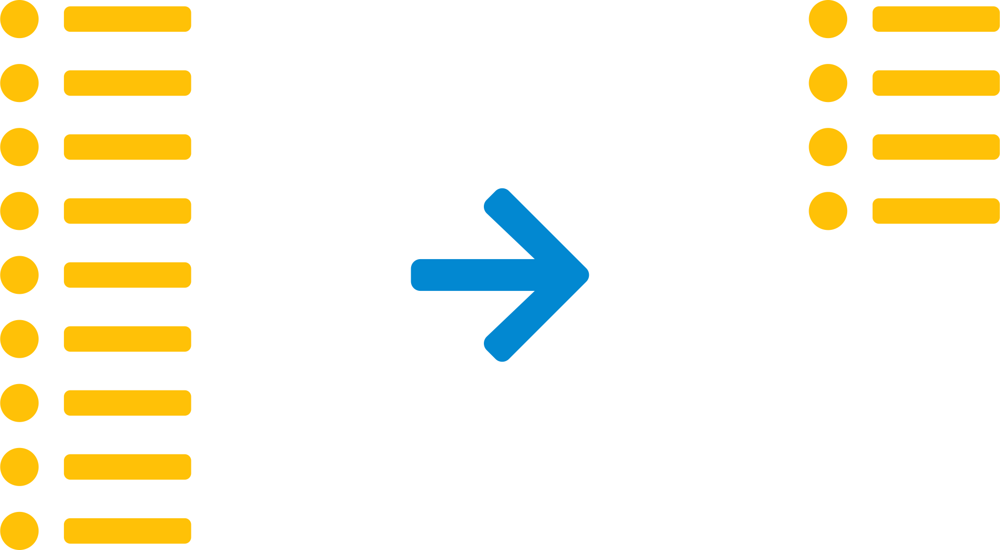

<!-- $theme: gaia -->

<link rel="stylesheet" href="../styles.css" />

<!-- *footer: Promotors: prof. Volckaert, prof. De Turck | Supervisors: Jasper Vaneessen, Dwight Kerkhove-->

<!-- Welkom enzo -->

# Optimizing ==CI== using
# ==Test Case Prioritization==

#### December 16, 2019

###### Pieter De Clercq

---

<!-- footer: Pieter De Clercq - December 16, 2019 -->
<!-- page_number: true -->

<!-- Dit zal ik vandaag bespreken -->

# Overview
1. What is ==C==ontinuous ==I==ntegration?

---
<!-- *page_same: true -->

# Overview
1. What is ==C==ontinuous ==I==ntegration?
2. Problem

---
<!-- *page_same: true -->

# Overview
1. What is ==C==ontinuous ==I==ntegration?
2. Problem
3. Existing solutions

---
<!-- *page_same: true -->

# Overview
1. What is ==C==ontinuous ==I==ntegration?
2. Problem
3. Existing solutions
4. Roadmap

---
<!-- *page_number: false -->
<!-- *template: gaia -->

# What is CI?

---

## Agile Software Development

<!-- Veronderstel een bedrijf dat Android applicaties maakt -->

<center>
	
</center>

---

## Agile Software Development
<!-- *page_same: true -->

<!-- Ontwikkelaars schrijven elk code -->

<center>
	
</center>

---

## Agile Software Development
<!-- *page_same: true -->

<!-- Code wordt gepusht -->

<center>
	
</center>

---

## Agile Software Development
<!-- *page_same: true -->

<!-- Tests worden uitgevoerd -->

<center>
	
</center>

---

## Agile Software Development
<!-- *page_same: true -->

<!-- Tests worden uitgevoerd -->

<center>
	
</center>

---

## Agile Software Development
<!-- *page_same: true -->

<!-- Tests worden uitgevoerd. Bestaande CI software: Jenkins, Travis, GitLab runners, GitHub Actions (nieuw) -->

<center>
	
</center>

---

## Agile Software Development
<!-- *page_same: true -->

<!-- Publishen naar Play store -->

<center>
	
</center>

---
<!-- *page_number: false -->
<!-- *template: gaia -->

<!-- Wat is nu precies het probleem? -->

# Problem

---

<!-- Tests zijn het probleem -->

# ==Tests!==

---

<!-- In het begin goed -->

# Tests

<center>
	
</center>

---
<!-- *page_same: true -->

<!-- Naarmate project groeit -->

# Tests

<center>
	
</center>

---
<!-- *page_same: true -->

<!-- Meer en meer tests die allemaal moeten uitvoeren: probleem. Veronderstel dat laatste test faalt, na 24 uur; dan 24u verspild.  -->

# Tests

<center>
	
</center>

---
<!-- *page_number: false -->
<!-- *template: gaia -->

# Existing solutions

---

# Existing solutions
## Test Case Selection

---

# Existing solutions
## Test Case Selection


---
<!-- *page_same: true -->

# Existing solutions
## Test Case Selection


---

# Existing solutions
## Test Suite Minimisation

---

# Existing solutions
## Test Suite Minimisation


---
<!-- *page_same: true -->

# Existing solutions
## Test Suite Minimisation



---

# Existing solutions
## Test Case Prioritization

---

# Existing solutions
## Test Case Prioritization


---
<!-- *page_same: true -->

# Existing solutions
## Test Case Prioritization


---

# Existing solutions
## Test Case Prioritization

- History based

---
<!-- *page_same: true -->

# Existing solutions
## Test Case Prioritization


- History based
- Diversity (Coverage) based

---
<!-- *page_same: true -->

# Existing solutions
## Test Case Prioritization

- History based
- Diversity (Coverage) based
  - Branch or Statement coverage?
  - Distance metric?

---
<!-- *page_same: true -->

# Existing solutions
## Test Case Prioritization

- History based
- Diversity (Coverage) based
  - Branch or Statement coverage?
  - Distance metric?
- Custom algorithms

---
<!-- *page_number: false -->
<!-- *template: gaia -->

# Roadmap

## 

---

# Roadmap


---
<!-- *page_same: true -->

# Roadmap


<p>
<p>

  
---
<!-- *page_same: true -->

# Roadmap


<p>
<p>


  
---
<!-- *page_same: true -->

# Roadmap


```json
{
  "commit": "6ae574e65678a7c819846d5a836297d18d1f07af",
  "changes": [
    "app/helpers/renderers/feedback_table_renderer.rb",
    "app/helpers/renderers/lcs_html_differ.rb"
  ],
  "failing_tests": ["test/renderers/renderers_test.rb"]
}
```

---
<!-- *page_same: true -->

# Roadmap


---
<!-- *page_same: true -->

# Roadmap


<p>
<p>
 16 pages

---
<!-- *page_same: true -->

# Roadmap


---
<!-- *page_same: true -->

# Roadmap


- Compare algorithms

---
<!-- *page_same: true -->

# Roadmap


- Compare algorithms
- Metapredictor

---
<!-- *page_same: true -->

# Roadmap


- Compare algorithms
- Metapredictor
- Plugin for Jenkins CI

---

<!-- *template: invert -->

> Lost ==time== is never found again.
> 
> <small>-- *Benjamin Franklin*</small>

---
<!-- *page_number: false -->
<!-- *template: gaia -->

# Questions?

---

## References
- Slides created using [Marp](https://marpit.marp.app/).
- Icons are property of [FontAwesome](https://fontawesome.com/).