<!-- $theme: gaia -->
<!-- $size: 4:3 -->

<link rel="stylesheet" href="../styles.css" />

<!-- *footer: Promotors: prof. dr. Volckaert, prof. dr. ir. De Turck | Supervisors: Jasper Vaneessen, Dwight Kerkhove-->

<!-- Note: Welkom allemaal, ik ga vandaag iets meer vertellen over mijn thesis, die gaat over het optimaliseren van Continue Integratie door middel van Test Prioritering -->

# Optimising ==CI== using
# ==Test Case Prioritisation==

#### June 19, 2020

###### Pieter De Clercq

---

<!-- footer: Pieter De Clercq - July 19, 2020 -->
<!-- page_number: true -->

<!-- Note: Even kort de structuur van deze presentatie schetsen: Eerst ga ik het probleem bespreken -->

## Overview
1) Problem

---

<!-- page_same: true -->

<!-- Note: Daarna ga ik reeds bestaande oplossingen overlopen -->

## Overview
1) Problem
2) Solutions

---

<!-- Note: Gevolgd door mijn eigen implementatie hiervan -->

## Overview
1) Problem
2) Solutions
3) Implementation

---

<!-- Note: En dan het effect van het toepassen van de besproken technieken op bestaande software -->

## Overview
1) Problem
2) Solutions
3) Implementation
4) Results

---

<!-- Note: Afsluiten ga ik doen met een korte demo zodat jullie je er iets bij kunnen voorstellen -->

## Overview
1) Problem
2) Solutions
3) Implementation
4) Results

---

<!-- page_same: false -->
<!-- *template: gaia -->

<!-- Note: Maar eerst en vooral -->

# ==But== first

---

<!-- Note: Deze thesis gaat over Continue Integratie (afgekort als CI); maar wat is dat nu eigenlijk? -->

# Just what is ==CI==?

---

<!-- Note: Voor de mensen die het niet zouden kennen, ga ik dit concept kort uitleggen met behulp van een voorbeeld van een bedrijf dat Android apps ontwikkelt -->

## Continuous Integration

<br/>
<br/>
<center>
	
  
**Example:** Android app
</center>

---

<!-- page_same: true -->

<!-- Note: Links zie je een werknemer van het bedrijf. Het ding in het midden stelt een server voor waarop een CI service draait. -->

## Continuous Integration

<br/>
<center>
	
</center>

---

<!-- Note: Aangezien een bedrijf meer dan 1 werknemer heeft die tegelijk aan andere delen van dezelfde applicatie werkt, is het belangrijk dat elke werknemer meerdere keren per dag zijn aanpassingen naar de CI server synchroniseert, om deze te integreren met de aanpassingen van andere mensen. -->

## Continuous Integration

<br/>
<center>
	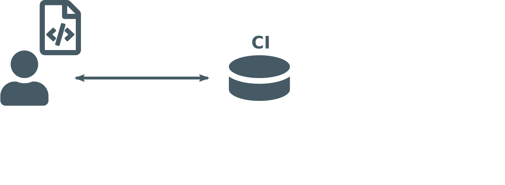
</center>

---

<!-- Note: Na deze synchronisatie zal de CI service een aantal checks uitvoeren, waaronder de tests van de applicatie -->

## Continuous Integration

<br/>
<center>
	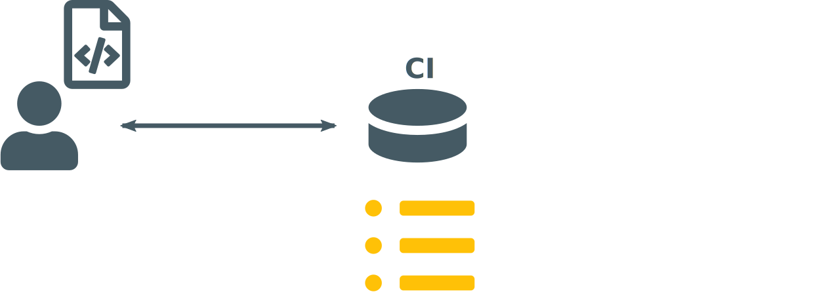
</center>

---

<!-- Note: Tests worden uitgevoerd -->

## Continuous Integration

<br/>
<center>
	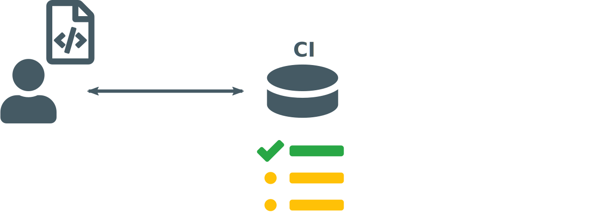
</center>

---

## Continuous Integration

<!-- Note: Het uitvoeren van deze tests kan 2 kanten uit, ofwel allemaal slagen, ofwel minstens 1 test die faalt -->

<br/>
<center>
	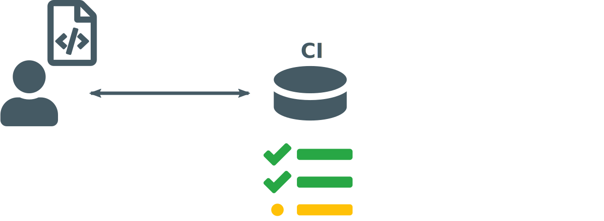
</center>

---

<!-- Note: In het geval dat er een falende test is, wordt de ontwikkelaar hiervan op de hoogte gebracht en kan hij het probleem oplossen -->

## Continuous Integration

<br/>
<center>
	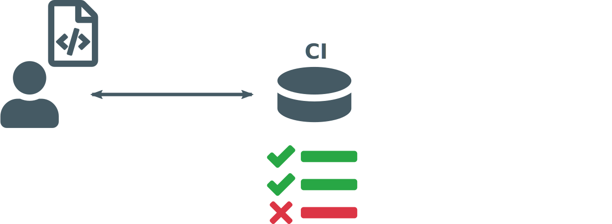
</center>

---

<!-- Note: In het andere geval slagen alle tests -->

## Continuous Integration

<br/>
<center>
	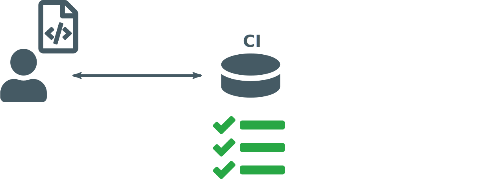
</center>

---

<!-- Note: En dan kan de CI service zodanig worden ingesteld om bijvoorbeeld na elke succesvolle integratie een nieuwe versie van de app naar de play store te pushen, zodat de gebruikers meteen alle nieuwste updates kunnen gebruiken -->

## Continuous Integration

<br/>
<center>
	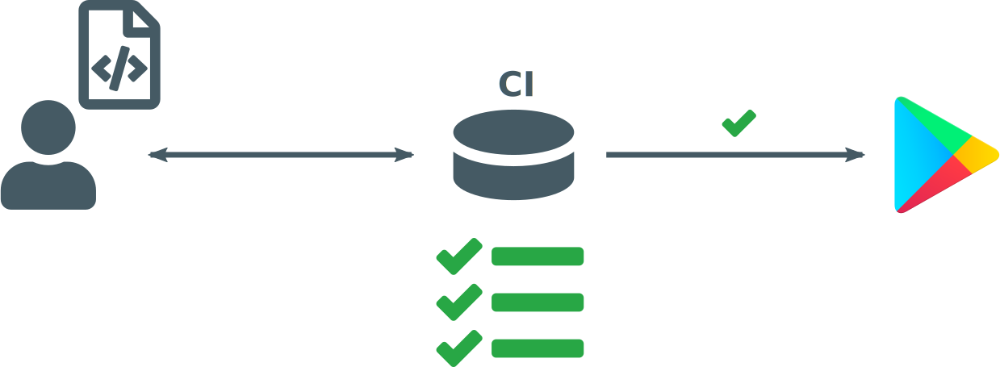
</center>

---

<!-- page_same: false -->
<!-- *template: gaia -->

<!-- Note: Nu, wat is het probleem hiermee? -->

# Problem?

---

<!-- Note: Het probleem zit hem eigenlijk in die tests -->


# ==Tests!==

---

<!-- Note: Bij het begin van de app zullen er namelijk niet veel tests zijn -->

## Tests

<center>
	
</center>

---

<!-- *page_same: true -->

<!-- Note: Maar naarmate de tijd verstrijkt en het project groeit -->

## Tests

<center>
	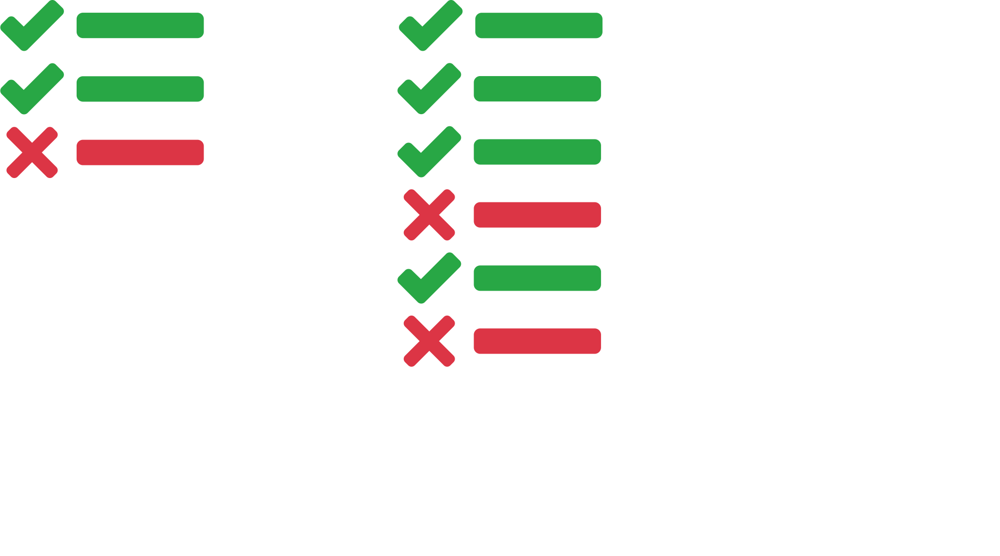
</center>

---

<!-- *page_same: true -->

<!-- Note: Komen er alsmaar meer tests bij, waardoor het uitvoeren van al die tests heel lang duurt en je dus niet snel weet of er een probleem in je code zit of niet -->

## Tests

<center>
	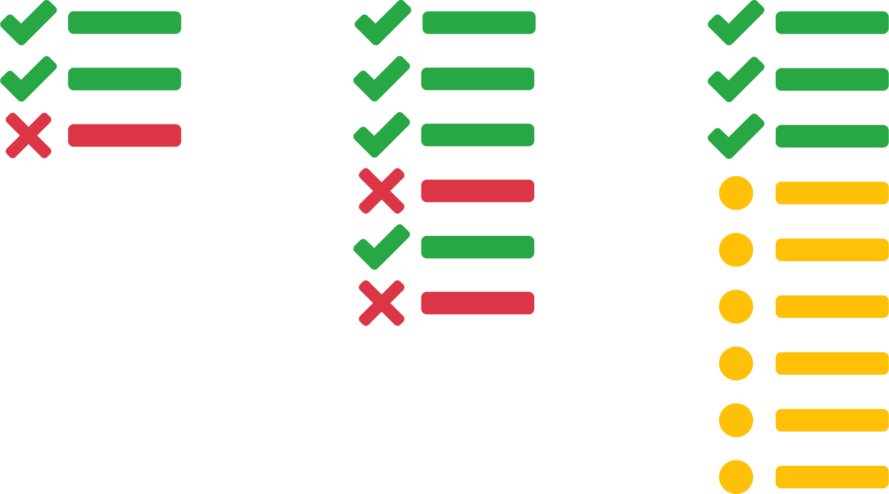
</center>

---

<!-- *template: gaia -->

<!-- Note: Wat kunnen we hier nu aan doen, er zijn drie bestaande oplossingen -->

# Solutions

---

<!-- Note: De eerste is test selectie -->

# Solutions

## Test Case ==Selection==

---

<!-- Note: In deze manier nemen we de verzameling tests en kijken we welke veranderingen er zijn toegebracht aan de code -->

## Solutions / Test Case ==Selection==


---

<!-- *page_same: true -->

<!-- Note: Door dat te analyseren kunnen we inschatten welke tests waarschijnlijk niet getroffen zullen zijn en die voor deze run niet uitvoeren-->

## Solutions / Test Case ==Selection==

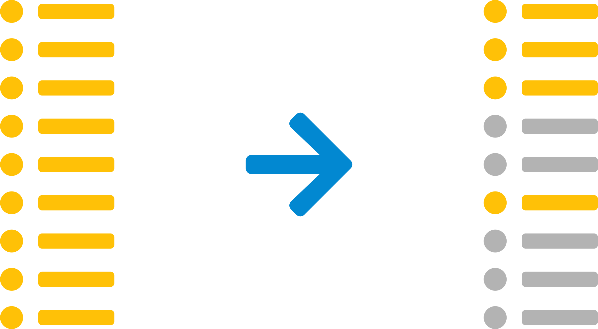

---

<!-- Note: De tweede manier is Test Minimalisatie -->

# Solutions
## Test Suite ==Minimisation==

---

<!-- Note: Hier nemen we opnieuw de verzameling tests -->

## Solutions / Test Suite ==Minimisation==


---

<!-- Note: Maar analyseren we welke tests volledig redundant zijn en permanent mogen worden verwijderd, bijvoorbeeld twee of meerdere tests die samen hetzelfde testen als één andere bestaande test -->

<!-- *page_same: true -->

## Solutions / Test Suite ==Minimisation==

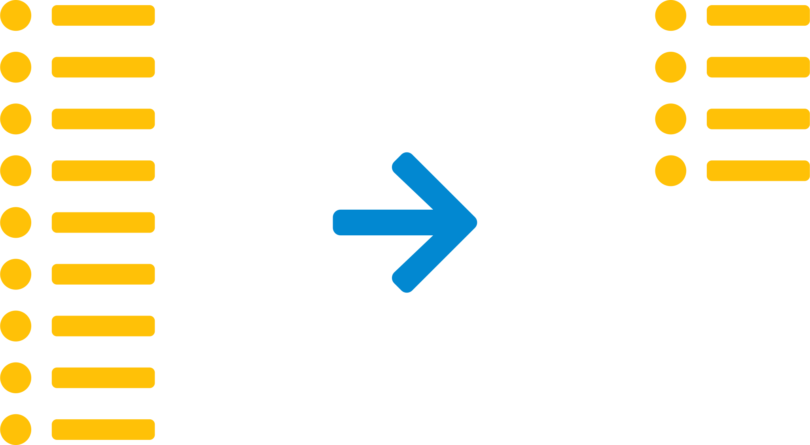

---

<!-- Note: De laatste manier is Test Prioritering -->

# Solutions
## Test Case ==Prioritisation==

---

<!-- Note: De vorige 2 manieren probeerden minder tests uit te voeren, maar soms kan het zijn, bijvoorbeeld bij medische, kritische software, dat wel altijd alle tests moeten worden uitgevoerd om geen enkel risico te lopen -->

## Solutions  / Test Case ==Prioritisation==


---

<!-- *page_same: true -->

<!-- Note: In dit geval kunnen we nog steeds een optimalisatie doen, door de tests in een zodanige volgorde uit te voeren dat we snel een falende test kunnen detecteren. Als er immers snel een falende test wordt gedetecteerd, kan de programmeur dit snel oplossen en de andere tests laten stoppen met uitvoeren aangezien hij toch al weet dat er een gefaald is -->

## Solutions / Test Case ==Prioritisation==


---

<!-- *template: gaia -->

<!-- Note: Ziezo, probleem opgelost -->

# So.. problem ==solved!==

---

<!-- Note: Of niet? -->

# ..right?

---

<!-- Note: Wel, de waarheid is dat dit in theorie heel goed klinkt, maar zoals vaak is het in de praktikj een ander paar mouwen -->


---

<!-- *template: invert -->

<!-- Note: Om dit te illustreren, laten we eens kijken naar wat er in de praktijk bestaat -->

# ==State== of the art

---

<!-- Note: Voor Java bestaat er Clover, wat recent opensource is gemaakt. Dit werkt vrij goed, maar enkel voor Java en het is ook niet eenvoudig om de manier van prioritering te beinvloeden -->

## State of the art

<br/>
<br/>


---

<!-- Note: En voor alle andere programmeertalen, welja, bestaat er niets dat algemeen toepasbaar en vooral uitbreidbaar is -->

## State of the art

<br/>
<br/>


---

<!-- *template: gaia -->

<!-- Note: Dit brengt ons naadloos bij mijn eigen implementatie  -->

# Implementation

---

<!-- Note: Deze implementatie bestaat uit 3 componenten die communiceren via een uniforme HTTP interface. Los daarvan bestaan deze componenten volledig op zichzelf en kunnen ze dus volledig los van elkaar worden aangepast en uitgebreid -->

# Implementation

## 

---

<!-- page_same: true -->

<!-- Note: De eerste component is de agent -->

# Implementation

## 

---

<!-- Note: Gevolgd door de controller -->

# Implementation

## 

---

<!-- Note: En tenslotte de predictor -->

# Implementation

## 

---

<!-- page_same: false -->

<!-- Note: Ik zal nu deze componenten bespreken, beginnend met de agent -->

# Implementation

## 

---

<!-- Note: De agent is afhankelijk van de programmeertaal en wordt in het gebruikte test framework ingeplugd. Deze agent heeft twee taken, de eerste taak is het uitvoeren van alle tests in een bepaalde volgorde die door de predictor wordt bepaald -->

## Implementation / Agent

<br/>
<br/>
<center>
	
</center>

---

<!-- Note: Daarnaast stuurt de agent nadat de tests zijn uitgevoerd ook feedback naar de controller -->

<!-- *page_same: true -->

## Implementation / Agent

<br/>
<br/>
<center>
	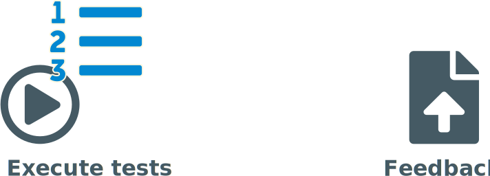
</center>

---

<!-- Note: Dan, de tweede component, de controller -->

# Implementation

## 

---

<!-- Note: De controller heeft ook twee taken: Enerzijds is dit een soort brug tussen de agent en de predictor, dus stuurt binnenkomende verzoeken door -->

## Implementation / Controller

<br/>
<br/>
<br/>
<center>

</center>

---

<!-- *page_same: true -->

<!-- Note: Anderzijds zal de controller ook feedback van de agent analyseren om de performance van volgende uitvoeringen te verbeteren -->

## Implementation / Controller

<br/>
<br/>
<br/>
<center>

</center>

---

<!-- Note: Dat brengt ons bij de derde component, de predictor -->

# Implementation

## 

---

<!-- Note: Zoals de naam al doet vermoeden, bepaalt de predictor de volgorde waarin de tests worden uitgevoerd -->

## Implementation / Predictor

<br/>
<br/>
<center>

</center>

---

<!-- *page_same: true -->

<!-- Note: Dit wordt gedaan aan de hand van 10 ingebouwde algoritmes -->

## Implementation / Predictor

<br/>
<br/>
<center>

</center>

---

<!-- *page_same: true -->

<!-- Note: Het belangrijkste aspect is dat de predictor uitbreidbaar is. Elk algoritme gebruikt dezelfde interface; een voorbeeld staat hieronder. Het algoritme kan de coverage, vorige uitvoeringsresultaten en uitvoeringstijden van de tests gebruiken om zo een volgorde te bepalen. In het voorbeeld hieronder wordt er simpelweg een volledig willekeurige volgorde gegenereerd -->

## Implementation / Predictor

<br/>
<br/>
<center>

</center>

<br/>

```python
# Generate a random order.
def predict(test_cases, coverage, results, duration):
	return shuffle(test_cases)
```

---

<!-- Note: Een van deze algoritmes heb ik zelf gemaakt, door de beste punten van de andere algoritmes bij elkaar te gooien. Dit algoritme bestaat uit 4 stappen -->

## Implementation / Alpha-algorithm

&nbsp;

---

<!-- page_same: true -->

<!-- Note: Eerst selecteren we alle tests die getroffen zijn door code aanpassingen in de huidige run én die ook minstens één keer gefaald zijn in de vorige 3 runs. We ordenen die op basis van uitvoeringstijd zodat de snelste tests eerder worden uitgevoerd -->

## Implementation / Alpha-algorithm

1) Unstable, affected test cases (by duration)

---

<!-- Note: Daarna doen we exact hetzelfde voor alle overblijvende getroffen tests (die dus niet onlangs gefaald zijn) -->

## Implementation / Alpha-algorithm

1) Unstable, affected test cases (by duration)
2) Affected test cases (by duration)

---

<!-- Note: Eens dat gedaan is worden alle overblijvende tests geordend op volgorde van hoeveel extra gecoverde code ze nog kunnen bijdragen (rekening houdend met de tests die al geselecteerd zijn) -->

## Implementation / Alpha-algorithm

1) Unstable, affected test cases (by duration)
2) Affected test cases (by duration)
3) Test cases based on added coverage

---

<!-- Note: Stel dat er uiteindelijk nog tests zouden overblijven die geen nieuwe coverage meer bijdragen, voeren we deze tests uit volgens stijgende uitvoeringstijd. Merk op dat deze tests eigenlijk redundant zijn en dus ook zouden kunnen worden overgeslagen, maar zoals eerder gezegd kiezen we ervoor om die toch uit te voeren voor de zekerheid -->

## Implementation / Alpha-algorithm

1) Unstable, affected test cases (by duration)
2) Affected test cases (by duration)
3) Test cases based on added coverage
4) Other test cases <code>[redunant]</code>

---

<!-- page_same: false -->

<!-- Note: De aandachtige luisteraar heeft misschien opgemerkt dat er nog een puzzelstuk ontbreekt: De predictor bestaat namelijk uit 10 algoritmes, die elk een uitvoeringsvolgorde bepalen -->

## Implementation / Meta predictor

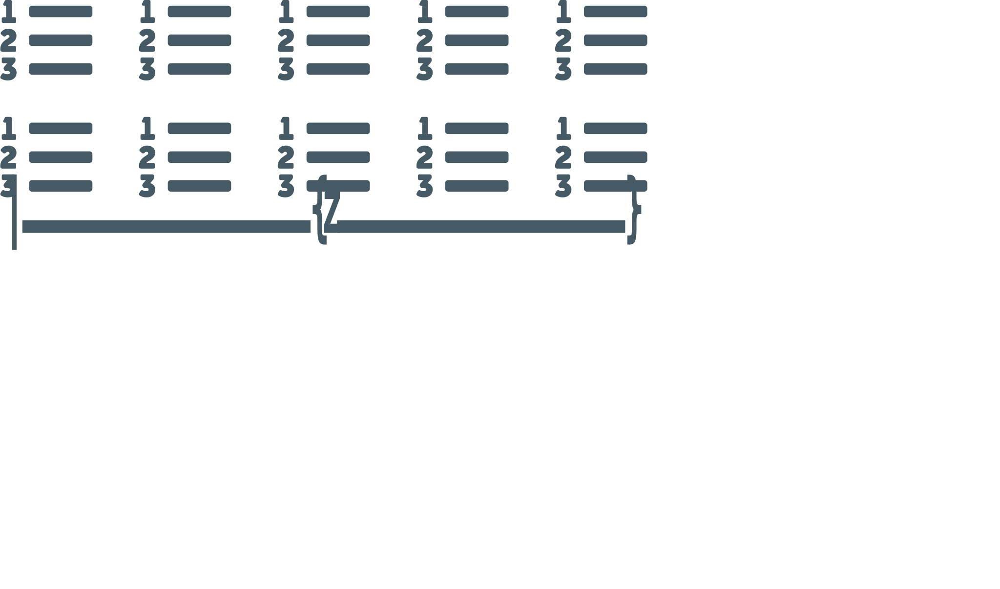

---

<!-- page_same: true -->

<!-- Note: Maar hoe moeten we nu kiezen wat de uiteindelijke volgorde moet zijn? -->

## Implementation / Meta predictor

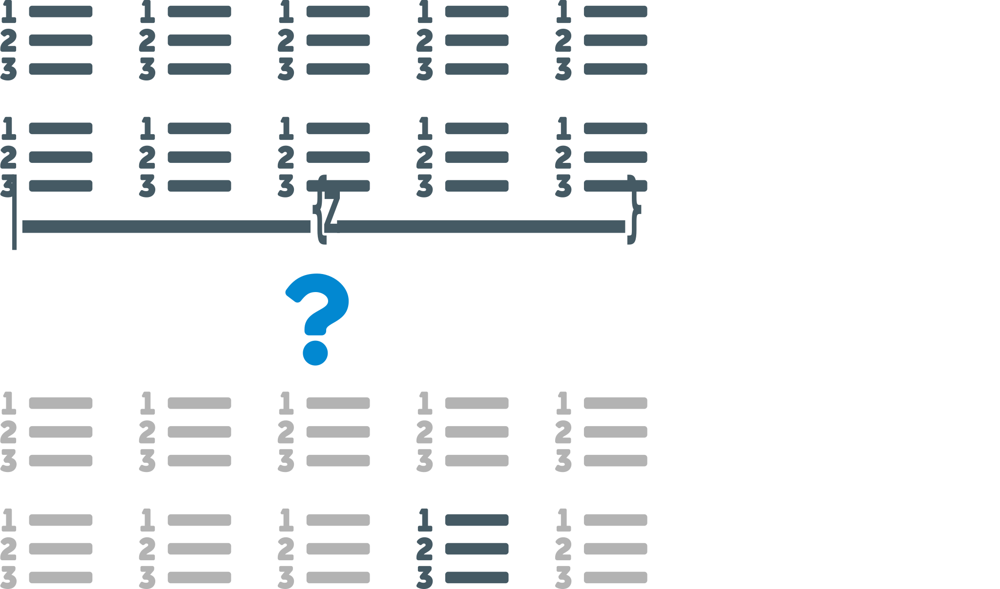

---

<!-- Note: Hiervoor dient de metapredictor -->

## Implementation / Meta predictor

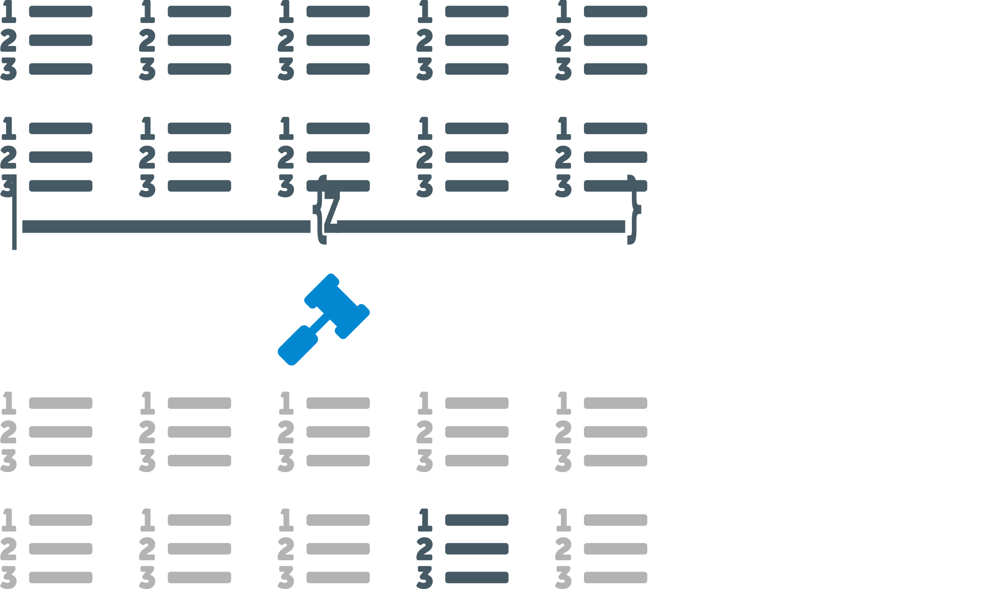

---

<!-- Note: De metapredictor in deze thesis is zeer eenvoudig en werkt door elk algoritme een score te geven voor het huidige project, en telkens het algoritme met de hoogste score te verkiezen. Deze score wordt bijgewerkt door de controller tijdens het analyseren van de uitgevoerde tests. Dit heeft als bijkomend voordeel dat als de aard van het project zou evolueren over de tijd, een ander algoritme mogelijks beter zou kunnen werken en dat dit automatisch wordt aangepast -->

<!-- Note: Een mogelijke uitbreiding zou kunnen zijn om hier Machine Learning voor te gebruiken. Verder zijn er ook bestaande algoritmes die zuiver gebaseerd zijn op Machine Learning -->

## Implementation / Meta predictor

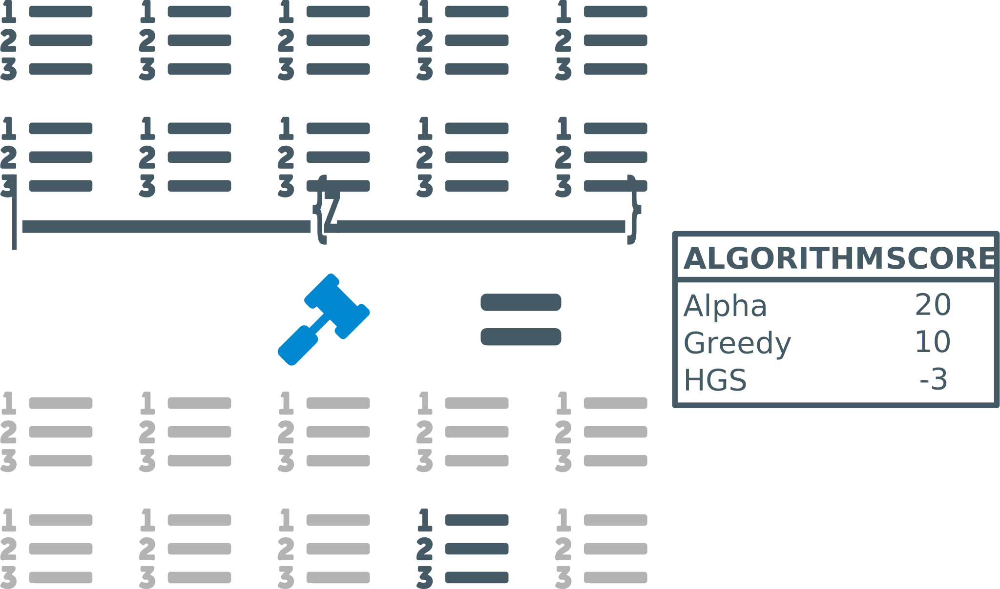

---

<!-- page_same: false -->
<!-- *template: gaia -->

<!-- Note: Nu we weten hoe het werkt, tijd om eens te kijken hoe goed het werkt -->

# Results

---

<!-- Note: Eerst en vooral heb ik in deze thesis drie onderzoeksvragen over de tests van een typische applicatie beantwoord -->

<!-- Note: De eerste onderzoeksvraag was om te kijken wat de kans is dat een test run gaat falen; door twee bronnen van een veelgebruikte publieke CI service te combineren blijkt dit tussen de 11 en 19% te liggen -->

## Results

#### RQ1: Failure probability

<br/>


<br/>
<br/>
<center>
	11% - 19%
</center>

---

<!-- Note: Vervolgens, op dezelfde service, blijkt dat de gemiddelde test run daar tussen de 2 en 5 minuten duurt. Wat aangeeft dat deze service voornamelijk voor kleine projecten wordt gebruikt. Er zijn echter ook een aantal uitschieters die zeer geavanceerde test technieken gebruiken en een aantal uur duren -->

## Results

#### RQ2: Average test run duration


---

<!-- Note: Tenslotte de kans dat een test run tweemaal na elkaar gaat falen, op deze service is dit iets meer dan 50% en dus zeer hoog -->

## Results

#### RQ3: Consecutive failure probability


---

## Results

<!-- Note: En nu dus de performance van mijn implementatie op het Dodona project van de UGent. We kunnen hierbij twee aspecten beschouwen. Te beginnen met het aantal uitgevoerde tests totdat de eerste falende test wordt gedetecteerd. -->

#### RQ4: Performance on Dodona (Tests)


<br />

<center>
  <strong># test cases:</strong> < 25x
  <br/>
  <span>until first observed failure</span>
</center>

---

## Results

<!-- Note: Daarnaast heeft het uitvoeren van 25 keer minder tests natuurlijk ook een invloed op de wachttijd tot de eerste falende test wordt waargenomen. Deze grafiek ziet er gelijkaardig uit, maar het verschil is veel significanter; tot wel 40 keer -->

#### RQ4: Performance on Dodona (Duration)


<br />

<center>
  <strong>duration:</strong> < 40x
  <br/>
  <span>until first observed failure</span>
</center>

---

<!-- *template: gaia -->

# Demo

---

<!-- *template: gaia -->

<!-- Note: Dus, samengevat --> 

# Wrapping up

---

## Conclusion

<!-- Note: Met CI kunnen we automatisch tests uitvoeren, iets wat zeer goed is om vroegtijdig fouten te detecteren -->

<center>
	
</center>

---

<!-- *page_same: true -->

<!-- Note: Veel tests kunnen echter een probleem vormen omdat je dan lang moet wachten op resultaten -->

## Conclusion

<center>
	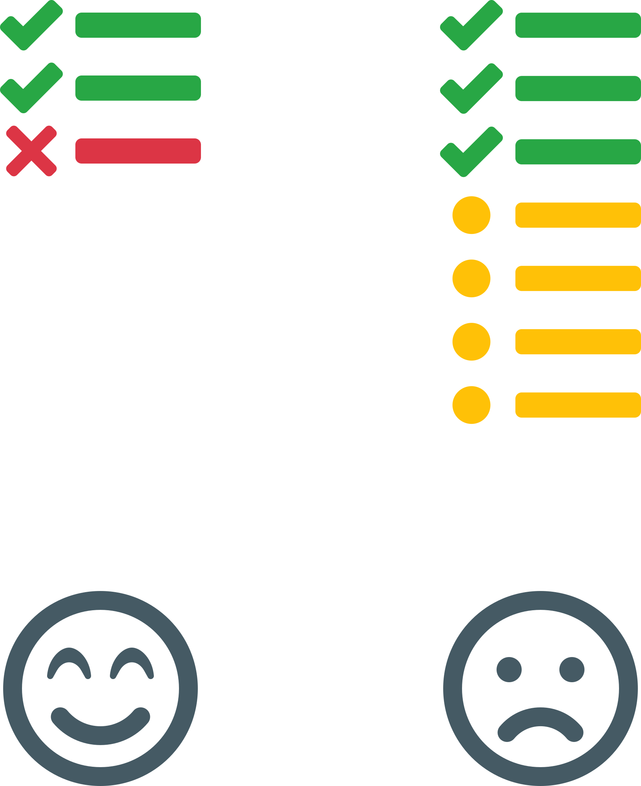
</center>

---

<!-- Note: Dit kunnen we oplossen met Test Prioritering, waarbij we tests herordenen om veel sneller een falende test kunnen detecteren -->

## Conclusion

<p>&nbsp;</p>
<center>
	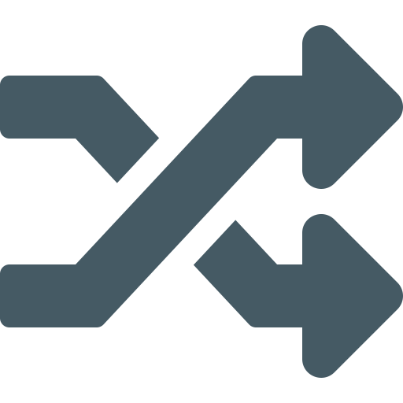
  <br/>
  <strong>Test Case Prioritisation</strong>
</center>

---

<!-- Note: Dit heeft als resultaat dat de wachttijd daalt en de productiviteit stijgt -->

## Conclusion

<p>&nbsp;</p>
<center>
	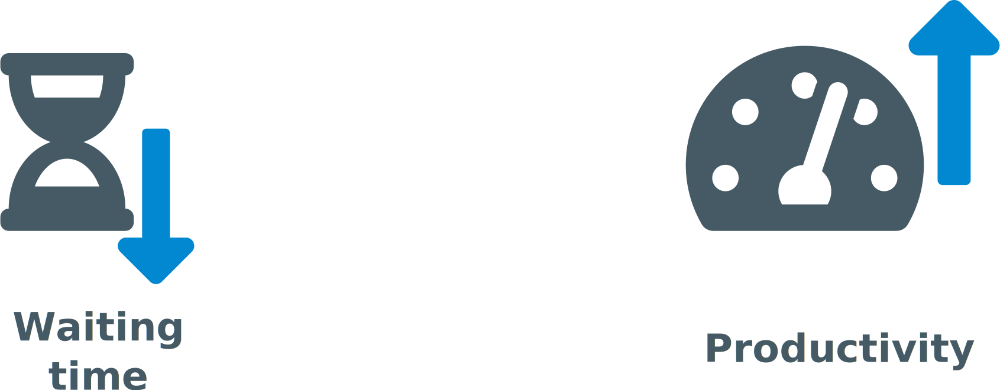
</center>

---

<!-- *template: gaia -->

<!-- Note: Zijn er nog vragen? -->

# Questions?

---

## References
- Slides created using [Marp](https://marpit.marp.app/).
- Icons are property of [FontAwesome](https://fontawesome.com/).