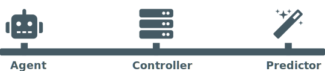
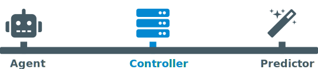
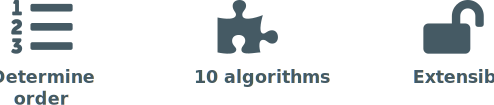
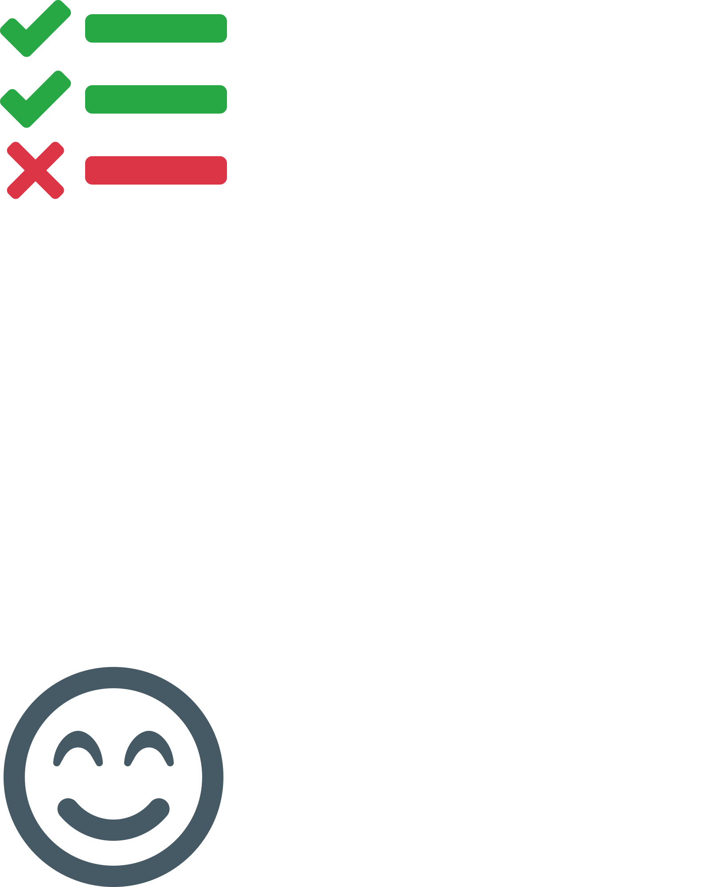

<!-- $theme: gaia -->
<!-- $size: 4:3 -->

<link rel="stylesheet" href="../styles.css" />

<!-- *footer: Promotors: prof. dr. Volckaert, prof. dr. ir. De Turck | Supervisors: Jasper Vaneessen, Dwight Kerkhove-->

<!-- Note: Welkom -->

<!-- Note: Meer vertellen -->

<!-- Note: Test Prioritering -->

# Optimising ==CI== using
# ==Test Case Prioritisation==

#### June 19, 2020

###### Pieter De Clercq

---

<!-- footer: Pieter De Clercq - July 19, 2020 -->
<!-- page_number: true -->

<!-- Note: Kort structuur -->

<!-- Note: Probleem bespreken -->

## Overview
1) Problem

---

<!-- page_same: true -->

<!-- Note: Bestaande oplossingen -->

## Overview
1) Problem
2) Solutions

---

<!-- Note: Eigen implementatie -->

## Overview
1) Problem
2) Solutions
3) Implementation

---

<!-- Note: Effect op bestaande -->

## Overview
1) Problem
2) Solutions
3) Implementation
4) Results

---

<!-- Note: Demo -->

## Overview
1) Problem
2) Solutions
3) Implementation
4) Results
5) Demo

---

<!-- page_same: false -->
<!-- *template: gaia -->

<!-- Note: Eerst en vooral -->

# ==But== first

---

<!-- Note: Wat? -->

<!-- Note: Afkorting CI -->

# Just what is ==CI==?

---

<!-- Note: Voorbeeld -->

<!-- Note: Bedrijf Android -->

## Continuous Integration

<br/>
<br/>
<center>
	
  
**Example:** Android app
</center>

---

<!-- page_same: true -->

<!-- Note: Werknemer -->

<!-- Note: CI service op server -->

## Continuous Integration

<br/>
<center>
	
</center>

---

<!-- Note: Meerdere keren per dag -->

<!-- Note: Sync met werknemers -->

<!-- Note: Integreren -->

## Continuous Integration

<br/>
<center>
	
</center>

---

<!-- Note: Checks (Stijl, Compileer) -->

<!-- Note: Tests -->

## Continuous Integration

<br/>
<center>
	
</center>

---

<!-- Note: Tests -->

## Continuous Integration

<br/>
<center>
	
</center>

---

## Continuous Integration

<!-- Note: Falen of Slagen -->

<br/>
<center>
	
</center>

---

<!-- Note: Weet waar is probleem? -->

<!-- Note: Oplossen -->

## Continuous Integration

<br/>
<center>
	
</center>

---

<!-- Note: Ofwel slagen -->

## Continuous Integration

<br/>
<center>
	
</center>

---

<!-- Note: Automatisch Play Store -->

<!-- Note: Nieuwste versie -->

## Continuous Integration

<br/>
<center>
	
</center>

---

<!-- page_same: false -->
<!-- *template: gaia -->

<!-- Note: Wat is probleem? -->

# Problem?

---

<!-- Note: In tests -->


# ==Tests!==

---

<!-- Note: Begin -->

<!-- Note: Weinig functionaliteit -->

<!-- Note: Weinig tests -->

## Tests

<center>
	
</center>

---

<!-- *page_same: true -->

<!-- Note: Tijd verstrijkt -->

## Tests

<center>
	
</center>

---

<!-- *page_same: true -->

<!-- Note: Meer functionaliteit -->

<!-- Note: Meer tests nodig -->

<!-- Note: Duurt langer [TODO PLAATS TIJD] -->

## Tests

<center>
	
</center>

---

<!-- *template: gaia -->

<!-- Note:  Wat aan doen? -->

<!-- Note: Drie oplossingen -->

# Solutions

---

<!-- Note: Test Selectie -->

# Solutions

## Test Case ==Selection==

---

<!-- Note: Beschouw tests -->

<!-- Note: Analyseer veranderingen -->

## Solutions / Test Case ==Selection==


---

<!-- *page_same: true -->

<!-- Note: Welke beinvloed? -->

## Solutions / Test Case ==Selection==


---

<!-- Note: Test Minimalisatie -->

# Solutions
## Test Suite ==Minimisation==

---

<!-- Note: Neem tests -->

## Solutions / Test Suite ==Minimisation==


---

<!-- Note: Voer alles uit -->

<!-- Note: Wanneer tevreden -->

<!-- Note: Permanent -->

<!-- Note: Verschil met Selectie -->

<!-- *page_same: true -->

## Solutions / Test Suite ==Minimisation==


---

<!-- Note: Prioritering -->

# Solutions
## Test Case ==Prioritisation==

---

<!-- Note: Vorige technieken -->

<!-- Note: Medische software -->

<!-- Note: Belangrijk alles uitvoeren -->

<!-- Note: Neem alle tests -->

## Solutions  / Test Case ==Prioritisation==


---

<!-- *page_same: true -->

<!-- Note: Voer allemaal uit -->

<!-- Note: Volgorde -->

<!-- Note: Snel falen -->

<!-- Note: Ontwikkelaar weet waar fout [5M] -->

## Solutions / Test Case ==Prioritisation==


---

<!-- *template: gaia -->

<!-- Note: Voila -->

# So.. problem ==solved!==

---

<!-- Note: Of niet -->

# ..right?

---

<!-- Note: Theorie -->

<!-- Note: Ander paar mouwen -->


---

<!-- *template: invert -->

<!-- Note: Wat bestaat? -->

# ==State== of the art

---

<!-- Note: Java -->

<!-- Note: Clover -->

<!-- Note: Vrij goed -->

<!-- Note: Niet aanpasbaar -->

## State of the art

<br/>
<br/>


---

<!-- Note: Andere talen -->

<!-- Note: Wel ja -->

## State of the art

<br/>
<br/>


---

<!-- *template: gaia -->

<!-- Note: Naadloos -->

# Implementation

---

<!-- Note: 3 componenten -->

<!-- Note: Uniforme interface -->

<!-- Note: Apart ontwikkelen -->

# Implementation

## 

---

<!-- page_same: true -->

<!-- Note: Agent -->

# Implementation

## 

---

<!-- Note: Controller -->

# Implementation

## 

---

<!-- Note: Tenslotte -->

# Implementation

## 

---

<!-- page_same: false -->

<!-- Note: Bespreken -->

<!-- Note: Agent -->

# Implementation

## 

---

<!-- Note: Ingeplugd in tests -->

<!-- Note: Dus Taal afhankelijk -->

<!-- Note: Twee taken -->

<!-- Note: Volgorde uitvoeren (predictor) -->

## Implementation / Agent

<br/>
<br/>
<center>
	
</center>

---

<!-- Note: Daarnaast -->

<!-- Note: Feedback over uitvoering -->

<!-- *page_same: true -->

## Implementation / Agent

<br/>
<br/>
<center>
	
</center>

---

<!-- Note: Controller -->

# Implementation

## 

---

<!-- Note: Agent / Predictor zijn onafh.-->

<!-- Note: Koppelen -->

## Implementation / Controller

<br/>
<br/>
<br/>
<center>

</center>

---

<!-- *page_same: true -->

<!-- Note: Verwerk resultaten agent -->

<!-- Note: Performantie volgende runs -->

## Implementation / Controller

<br/>
<br/>
<br/>
<center>

</center>

---

<!-- Note: Predictor -->

# Implementation

## 

---

<!-- Note: Volgorde Falen -->

## Implementation / Predictor

<br/>
<br/>
<center>

</center>

---

<!-- *page_same: true -->

<!-- Note: 10 Algoritmes -->

<!-- Note: Elk eigen volgorde genereren -->

## Implementation / Predictor

<br/>
<br/>
<center>

</center>

---

<!-- *page_same: true -->

<!-- Note: Uitbreidbaar -->

<!-- Note: Interface -->

<!-- Note: Voorbeeld [9M] -->

## Implementation / Predictor

<br/>
<br/>
<center>

</center>

<br/>

```python
# Generate a random order.
def predict(test_cases, coverage, results, duration):
	return shuffle(test_cases)
```

---

<!-- Note: Een van 10 -->

<!-- Note: Alpha -->

<!-- Note: Zelf gemaakt -->

<!-- Note: Combineer andere -->

## Implementation / Alpha-algorithm

&nbsp;

---

<!-- page_same: true -->

<!-- Note: Code aangepast -->

<!-- Note: Onlangs gefaald (2 vorige) -->

## Implementation / Alpha-algorithm

1) Unstable, affected test cases (by duration)

---

<!-- Note: Code aangepast -->

## Implementation / Alpha-algorithm

1) Unstable, affected test cases (by duration)
2) Affected test cases (by duration)

---

<!-- Note: Overblijvende tests -->

<!-- Note: Nog niet geteste lijnen -->

## Implementation / Alpha-algorithm

1) Unstable, affected test cases (by duration)
2) Affected test cases (by duration)
3) Test cases based on added coverage

---

<!-- Note: Elke lijn getest -->

<!-- Note: Redundant -->

<!-- Note: Toch uitvoeren [10M] -->

## Implementation / Alpha-algorithm

1) Unstable, affected test cases (by duration)
2) Affected test cases (by duration)
3) Test cases based on added coverage
4) Other test cases <code>[redundant]</code>

---

<!-- page_same: false -->

<!-- Note: Aandachtige luisteraar -->

<!-- Note: 10 algoritmes -->

<!-- Note: 10 volgordes -->

## Implementation / Meta predictor


---

<!-- page_same: true -->

<!-- Note: Hoe weten? -->

## Implementation / Meta predictor


---

<!-- Note: Meta predictor -->

## Implementation / Meta predictor


---

<!-- Note: Eenvoudige tabel -->

<!-- Note: Score per algo -->

<!-- Note: Controller verhoogt als goed -->

<!-- Note: Machine Learning -->

## Implementation / Meta predictor


---

<!-- page_same: false -->
<!-- *template: gaia -->

<!-- Note: Weten hoe -->

<!-- Note: Kijken hoe goed -->

# Results

---

## Results

<!-- Note: Dodona UGent -->

<!-- Note: Aantal tests tot faal -->

<!-- Note: Grijs origineel -->

<!-- Note: Rood Alpha -->

<!-- Note: 25 keer -->

#### Performance on Dodona (Tests)


<br />

<center>
  <strong># test cases:</strong> < 25x
  <br/>
  <span>until first observed failure</span>
</center>

---

## Results

<!-- Note: Tijd -->

<!-- Note: Grafiek gelijkaardig -->

<!-- Note: 40 keer -->

#### Performance on Dodona (Duration)


<br />

<center>
  <strong>duration:</strong> < 40x
  <br/>
  <span>until first observed failure</span>
</center>

---

<!-- *template: gaia -->

<!-- Note: Demo -->

# Demo

---

<!-- *template: gaia -->

<!-- Note: Samengevat --> 

# Wrapping up

---

## Conclusion

<!-- Note: Tests goed -->

<!-- Note: Fouten detecteren -->

<!-- Note: Eindgebruikers -->

<center>
	
</center>

---

<!-- *page_same: true -->

<!-- Note: Veel tests -->

<!-- Note: Probleem -->

<!-- Note: Traag feedback -->

## Conclusion

<center>
	
</center>

---

<!-- Note: Oplossen -->

<!-- Note: Test Prioritering -->

<!-- Note: Rangschikken -->

<!-- Note: Snel falen -->

## Conclusion

<p>&nbsp;</p>
<center>
	
  <br/>
  <strong>Test Case Prioritisation</strong>
</center>

---

<!-- Note: Resultaat -->

<!-- Note: Wachten daalt -->

<!-- Note: Productiviteit stijgt -->

## Conclusion

<p>&nbsp;</p>
<center>
	
</center>

---

<!-- *template: gaia -->

<!-- Note: Was presentatie -->

<!-- Note: Eventuele vragen -->

# Questions?

---

## References
- Slides created using [Marp](https://marpit.marp.app/).
- Icons are property of [FontAwesome](https://fontawesome.com/).
