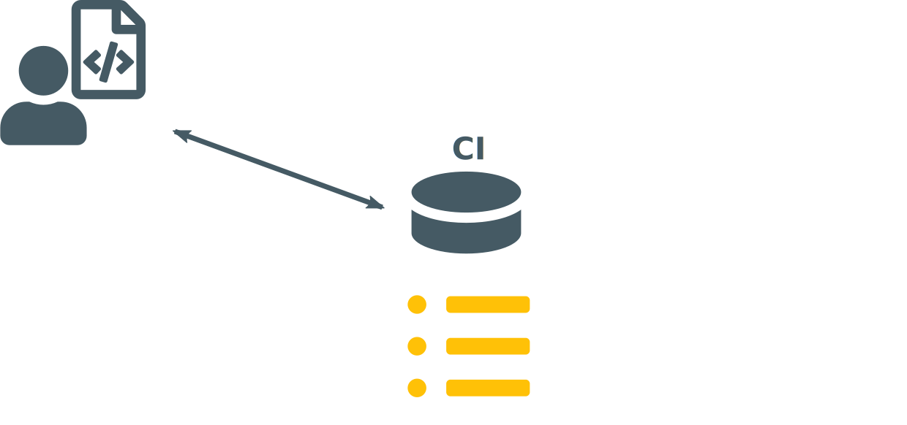

<!-- $theme: gaia -->

<link rel="stylesheet" href="../styles.css" />

<!-- *footer: Promotors: prof. dr. Volckaert, prof. dr. ir. De Turck | Supervisors: Jasper Vaneessen, Dwight Kerkhove-->

# Optimising ==CI== using
# ==Test Case Prioritisation==

#### June 19, 2020

###### Pieter De Clercq

---

<!-- footer: Pieter De Clercq - July 19, 2020 -->
<!-- page_number: true -->

## Overview
1) Problem

---

<!-- page_same: true -->

## Overview
1) Problem
2) Solutions

---

## Overview
1) Problem
2) Solutions
3) Implementation

---

## Overview
1) Problem
2) Solutions
3) Implementation
4) Results

---

## Overview
1) Problem
2) Solutions
3) Implementation
4) Results
5) (Demo)

---

<!-- page_same: false -->
<!-- *template: gaia -->

# ==But== first

---

# Just what is ==CI==?

---

## Continuous Integration

<center>
	
  
**Example:** Android app
</center>

---

<!-- page_same: true -->
## Continuous Integration

<center>
	
</center>

---

## Continuous Integration

<center>
	
</center>

---

## Continuous Integration

<center>
	
</center>

---

## Continuous Integration

<center>
	
</center>

---

## Continuous Integration

<center>
	
</center>

---

## Continuous Integration

<center>
	
</center>

---

## Continuous Integration

<center>
	
</center>

---

## Continuous Integration

<center>
	
</center>

---

## Continuous Integration

<center>
	
</center>

---

## Continuous Integration

<center>
	
</center>

---

## Continuous Integration

<center>
	
</center>

---

## Continuous Integration

<center>
	
</center>

---

## Continuous Integration

<center>
	
</center>

---

<!-- page_same: false -->

<!-- *template: gaia -->

# Problem?

---


# ==Tests!==

---

## Tests

<center>
	
</center>

---

<!-- *page_same: true -->

## Tests

<center>
	
</center>

---

<!-- *page_same: true -->

## Tests

<center>
	
</center>

---

<!-- *template: gaia -->

# Solutions

---

# Solutions

## Test Case ==Selection==

---

## Solutions / Test Case ==Selection==


---

<!-- *page_same: true -->

## Solutions / Test Case ==Selection==


---

# Solutions
## Test Suite ==Minimisation==

---

## Solutions / Test Suite ==Minimisation==


---

<!-- *page_same: true -->

## Solutions / Test Suite ==Minimisation==


---

# Solutions
## Test Case ==Prioritisation==

---

## Solutions  / Test Case ==Prioritisation==


---

<!-- *page_same: true -->

<!-- Voorbeeld: kritische tests voor medische shizzle -->

## Solutions / Test Case ==Prioritisation==


---

<!-- *template: gaia -->

# So.. problem ==solved!==

---

# ..right?

---

<!-- Wel, de waarheid is dat het probleem hiermee niet is opgelost. -->


---

<!-- *template: invert -->

<!-- Dit is theoretisch allemaal heel mooi, maar laten we eens kijken naar welke implementaties er bestaan. -->

# ==State== of the art

---

<!-- Clover (door Atlassian - BitBucket) bestaat voor Java, is onlangs geopensourced. Werkt vrij goed maar enkel voor Java en 5 ingebouwde manieren om tests te herordenen. -->

## State of the art

<br/>
<br/>


---

<!-- Voor alle andere programmeertalen is er geen algemeen iets dat gemakkelijk uitbreidbaar is. -->

## State of the art

<br/>
<br/>


---

<!-- *template: gaia -->

# Implementation

---

# Implementation

## 

---

<!-- page_same: true -->

# Implementation

## 

---

# Implementation

## 

---

# Implementation

## 

---

<!-- page_same: false -->

# Implementation

## 

---

<!-- Enige programmeertaalafhankelijke component -->

## Implementation / Agent

<br/>
<br/>
<center>
	
</center>

---

<!-- *page_same: true -->

## Implementation / Agent

<br/>
<br/>
<center>
	
</center>

---

# Implementation

## 

---

<!-- Routeren tussen agent en predictor -->

## Implementation / Controller

<br/>
<br/>
<br/>
<center>

</center>

---

<!-- *page_same: true -->

<!-- De resultaten analyseren nadat tests zijn uitgevoerd -->

## Implementation / Controller

<br/>
<br/>
<br/>
<center>

</center>

---

# Implementation

## 

---

## Implementation / Predictor

<br/>
<br/>
<center>

</center>

---

<!-- *page_same: true -->

## Implementation / Predictor

<br/>
<br/>
<center>

</center>

---

<!-- *page_same: true -->

## Implementation / Predictor

<br/>
<br/>
<center>

</center>

<br/>

```python
# Generate a random order.
def predict(test_cases, coverage, results, duration):
	return shuffle(test_cases)
```

---

<!-- Eigen algoritme door bestaande algoritmes te combineren. -->

## Implementation / Alpha-algorithm

&nbsp;

---

<!-- page_same: true -->

## Implementation / Alpha-algorithm

1) Unstable, affected test cases (by duration)

---

## Implementation / Alpha-algorithm

1) Unstable, affected test cases (by duration)
2) Affected test cases (by duration)

---

## Implementation / Alpha-algorithm

1) Unstable, affected test cases (by duration)
2) Affected test cases (by duration)
3) Test cases based on additional coverage

---

## Implementation / Alpha-algorithm

1) Unstable, affected test cases (by duration)
2) Affected test cases (by duration)
3) Test cases based on additional coverage
4) Other test cases

---

## Implementation / Alpha-algorithm

1) Unstable, affected test cases (by duration)
2) Affected test cases (by duration)
3) Test cases based on additional coverage
4) Other test cases <code>[redunant]</code>

---

<!-- page_same: false -->

<!-- Er is echter wel nog een probleem. Zoals gezegd zijn er in de predictor 10 algoritmes beschikbaar, met elk een eigen voorspelde volgorde. -->

## Implementation / Meta predictor


---

<!-- page_same: true -->

<!-- Maar hoe kunnen we uit al die 10 volgordes nu bepalen wat de finale moet zijn? -->

## Implementation / Meta predictor


---

<!-- Dit is precies waar de metapredictor voor dient. -->

## Implementation / Meta predictor


---

<!-- Werkt door elk algoritme een score te geven per applicatie en dan degene met de hoogste te kiezen. Score wordt bijgewerkt in de feedbackfase van de controller. -->

## Implementation / Meta predictor


---

<!-- page_same: false -->

<!-- *template: gaia -->

# Results

---

## Results

#### RQ1: Failure probability

<br/>


<br/>
<br/>
<center>
	11% - 19%
</center>

---

## Results

#### RQ2: Average test run duration


---

## Results

#### RQ3: Consecutive failure probability


---

## Results

#### RQ4: Performance on Dodona


<br />
<br />
<center>
  <strong># test cases:</strong> < 25x | <strong>duration:</strong> < 40x
</center>

---

<!-- *template: gaia -->

# Demo

---

<!-- *template: gaia -->

# Wrapping up

---

## Conclusion

<!-- Tests zijn goed -->
<!-- De oplossing is om ze te herordenen -->
<!-- Uitvoeringstijd daalt, Productiviteit stijgt -->

<center>
	
</center>

---

<!-- *page_same: true -->

## Conclusion

<!-- Maar veel tests kunnen al snel een probleem worden -->

<center>
	
</center>

---

## Conclusion

<!-- De oplossing is om ze te herordenen -->

<p>&nbsp;</p>
<center>
	
  <br/>
  <strong>TCP</strong>
</center>

---

## Conclusion

<!-- Uitvoeringstijd daalt, Productiviteit stijgt -->

<p>&nbsp;</p>
<center>
	
</center>

---

<!-- *template: gaia -->

# Questions?

---

## References
- Slides created using [Marp](https://marpit.marp.app/).
- Icons are property of [FontAwesome](https://fontawesome.com/).